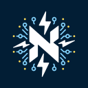

# NLightning - A C# dotNet Lightning Implementation

[](https://github.com/ipms-io/nlightning/actions/workflows/dotnet.yml)
&nbsp;
[](https://github.com/ipms-io/nlightning)
&nbsp;
[](LICENSE)
&nbsp;


Welcome to the C# implementation of the Lightning Network!

This project aims to provide a robust and efficient implementation of the Lightning Network protocol in C#.
We adhere to the Basis of Lightning Technology (BOLT) specifications to ensure compatibility with other
Lightning Network implementations.

 

## Documentation

You can check our documentation page [here](https://nlightning.ipms.io/)

## Features

- **BOLT Compatibility:** We follow the Basis of Lightning Technology (BOLT) specifications to maintain compatibility
  with other Lightning Network implementations.
- **Modular Design:** The implementation is designed with modularity in mind, making it easy to extend and customize.
- **Efficiency:** We strive for efficient and optimized code to ensure fast and reliable performance.
- **Community Support:** We welcome contributions and feedback from the community to improve and enhance the project.

## Current State of BOLT implementation

| BOLT                                                      | Library (API) | Full Node (daemon) |
|-----------------------------------------------------------|:-------------:|:------------------:|
| BOLT 1: Base Protocol                                     |       ✅       |         ❌          |
| BOLT 2: Peer Protocol for Channel Management              |       ✅       |         ❌          |
| BOLT 3: Bitcoin Transaction and Script Formats            |       ✅       |         ❌          |
| BOLT 4: Onion Routing Protocol                            |       ❌       |         ❌          |
| BOLT 5: Recommendations for On-chain Transaction Handling |       ❌       |         ❌          |
| BOLT 7: P2P Node and Channel Discovery                    |       ❌       |         ❌          |
| BOLT 8: Encrypted and Authenticated Transport             |       ✅       |         ✅          |
| BOLT 9: Assigned Feature Flags                            |       ✅       |         ✅          |
| BOLT 10: DNS Bootstrap and Assisted Node Location         |       ✅       |         ❌          |
| BOLT 11: Invoice Protocol for Lightning Payments          |       ✅       |         ✅          |

## Quick Start

This section will guide you through getting a copy of NLightning up and running on your local machine for development
and testing purposes.

### Prerequisites

Before you begin, ensure you have the following installed on your system:

- [.NET 9.0 SDK](https://dotnet.microsoft.com/download/dotnet/9.0) or any later 9.x version
- Git (for cloning the repository)

This project uses a global.json file to pin the .NET SDK to version 9.0.0, but with rollForward:
"latestMinor" it will accept any newer 9.x release (e.g., 9.1.x, 9.2.x).
You must have .NET SDK 9.0.0 or later within the 9.x line installed.
SDK versions outside the 9.x line (e.g., 8.x or 10.x) are not supported.

### Installation

1 - **Clone the repository**

First, clone the NLightning repository to your local machine using Git:

```sh
git clone https://github.com/ipms-io/nlightning.git
cd nlightning
```

2 - **Build the project**

Navigate to the project directory and build the project using the .NET CLI to ensure all dependencies are properly
installed:

```sh
dotnet build
```

3 - **Versioning Policy**

Check the versioning policy of the project [here](VERSIONING.md)

4 - **Contribute to Development**

As NLightning is currently under active development, it may not be in a runnable state just yet. However, this opens up
a great opportunity for you to contribute. Whether it's implementing new features, fixing bugs, or improving
documentation, your contributions are invaluable to making NLightning fully operational.

To start contributing:

- Explore the [Issues](https://github.com/ipms-io/nlightning/issues) section on GitHub to find out what needs to be
  worked on.
- Review our [Contributing Guidelines](CONTRIBUTING.md) for details on making contributions, such as how to create pull
  requests.
- If you have a new idea or feature you'd like to work on, don't hesitate to open a new issue to discuss it with the
  project maintainers.

We encourage you to dive into the codebase, familiarize yourself with the project structure, and see where your skills
and interests can help drive NLightning forward.

### Testing

To verify that everything is set up correctly, you can run the included unit tests:

```sh
dotnet test
```

#### MacOS Users

To run the containerized tests, we need to connect directly to the docker containers, but if you're using macOS, you
won't be able to, thanks to the way Docker for Mac is implemented.

We're using [Docker Mac Net Connect](https://github.com/chipmk/docker-mac-net-connect) due to its simplicity. Run:

```sh
# Install via Homebrew
$ brew install chipmk/tap/docker-mac-net-connect

# Run the service and register it to launch at boot
$ sudo brew services start chipmk/tap/docker-mac-net-connect
```

## License

This project is licensed under the MIT License. See the [LICENSE](LICENSE) file for details.

## Support

As we venture into the development of NLightning, our mission is to create a high-performance, secure, and easy-to-use
Lightning Network implementation in C#. This project not only aims to contribute to the scalability and adoption of
Bitcoin but also seeks to provide developers with a reliable toolset for building innovative applications on top of the
Lightning Network.

However, this journey is not without its challenges. Development, testing, and maintenance require significant resources
and dedicated effort. While we are passionate about pushing the boundaries of what's possible with Lightning Network
technology, we also recognize the power of community support in achieving these ambitious goals.

### Why Your Support Matters

Your donations will directly contribute to:

- Speeding up the development process by allowing us to dedicate more time to the project.
- Improving documentation and tutorials, making the technology accessible to more developers.
- Expanding our testing frameworks to ensure reliability and security.
- Supporting the infrastructure needed for development and testing.

By donating, you become an integral part of the NLightning project, helping to ensure its success and continued
advancement. Whether you're a user looking forward to a stable release, a developer eager to contribute, or simply a
supporter of open-source innovation, your contribution is immensely appreciated.

### How to Support Us

If you find this project useful, consider supporting us:

- **LNAddress**: `nlightning@ipms.io`
- **Bitcoin on-chain address**: `bc1pgtdj7qtdfrate2hhnt5lecayvgafhmpu6t250dg7d0sdrwtwcnkq8usux8`

No matter the size, every donation makes a difference and is deeply appreciated. Together, we can make NLightning a
cornerstone of the Lightning Network ecosystem.

Thank you for your support and belief in our project.

## Contact

If you have any questions, feedback, or suggestions, feel free to reach out to us at
[reachus@ipms.io](mailto:reachus@ipms.io).
